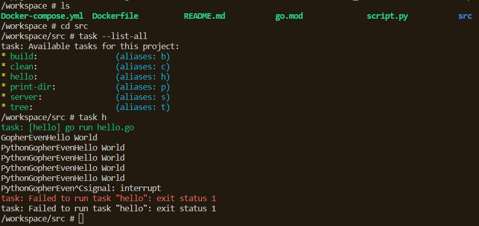

# CS330_Presentation

Author: Michael Bopp
Last Edited: 8/26/23

# Downloading Docker

If you are using any version of Windows, specific WSL dependencies must be installed to run Docker software.

Likewise any flavor of Unix: BSD, GNU/Linux, MacOSX has specific instructions on the internet.

I recommend reading or watching a short tutorial to download & start Docker Desktop on your specific OS.

You can proceed with the rest of this tutorial without Docker, you'll just need to download the official Go compiler & Python interpretter.

# Prepare Environment Variables

If you are planning to use Docker you'll need to set an environment variable.

```powershell
# Windows
# Path to project: i.e. <driveletter:\...\CS330_Presentation>
$env:BUILD_CONTEXT="insert file path here"

# Clear env var if a mistake occurs
Remove-Item Env:BUILD_CONTEXT
```

```bash
# Unix OSes
# Path to project
export BUILD_CONTEXT="/path/to/directory"

# Might need to source or restart shell after export
source ~/.bashrc

# Clear env var
unset BUILD_CONTEXT
```

# Docker-compose Script

```bash
# Build a Docker image
docker-compose build --no-cache

# Build a Docker container & attach to the container in a shell
docker-compose run cs330_service
```

# Taskfile execution

By this point you should be in a Docker container, or have Go & Python installed.



